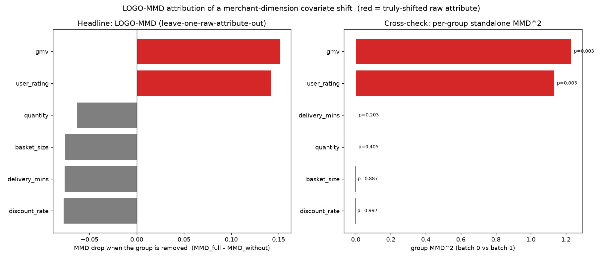
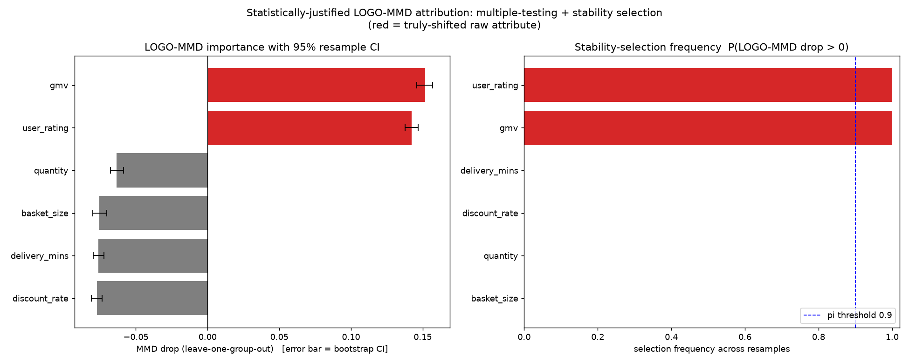
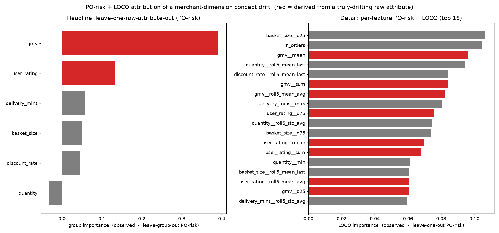

# Two-Dimensional Distribution-Shift Localization for a Marketplace

**Feature-selection distribution-shift (FSDS) attribution over a `user → order(item) → merchant` hierarchy, with statistically-justified multi-layer localization along both the merchant and the buyer axes.**

---

## 1. Executive summary

When a new batch of data arrives (new merchants onboarded, a new cohort of buyers, a new time window), two questions matter in production:

1. **Did the distribution change?** (detection)
2. **What changed, and where?** (attribution / localization)

This report describes a reusable toolchain that answers both, built on the repository's causal-objective machinery and a kernel two-sample test. It:

- rolls raw order-level events **up to an entity dimension** (merchant *or* buyer) with rich + rolling aggregations;
- **detects** a shift between the existing batch (`W=0`) and the new batch (`W=1`) with an exact permutation test (MMD for covariate shift, PO-risk for concept drift);
- **localizes** the shift, layer by layer, to the responsible feature groups and individual features, with **hierarchical false-discovery-rate control**;
- reports, for every localized feature, an **actionable split threshold and per-batch quantiles**;
- runs the whole procedure on **two entity axes at once** (merchant and buyer), so it attributes a marketplace change to *which side* (supply vs demand) and *which features* moved.

On synthetic data with known ground truth, every module recovers exactly the injected drivers with **zero leaf-level false discoveries**.

---

## 2. Why this is useful in production

- **Root-causing metric moves.** When GMV or rating dips for the new cohort, the localization tree points at the exact aggregated features (e.g. `gmv__mean`, `user_rating__median`) and the raw signal behind them, instead of a dashboard full of undifferentiated drift alarms.
- **Supply vs demand attribution.** The two-dimensional structure separates a *merchant-side* change (new sellers behaving differently) from a *buyer-side* change (new shopper cohort), which usually imply different actions.
- **Actionable thresholds.** Each leaf carries a KS-optimal split (`gmv__mean > 27.8` cleanly separates new vs existing merchants) and quantile grids — ready for rules, monitors, or segment definitions.
- **Trustworthy alerts.** Permutation validity + a stability threshold + priority ranking mean the surfaced drivers are defensible and ranked, not just the top of a noisy list — fewer false alarms for on-call.
- **Retraining / reweighting triggers.** Knowing *what kind* of shift (covariate vs concept) and *which features* tells you whether to reweight, retrain, or ignore.
- **Reusable.** Adding an axis (item, category, region) or a new raw attribute is a config change; the output is machine-readable JSON for downstream UIs.

---

## 3. Data model

```
        places                for                sold_by
 user ----------> order(item) ----------> item ----------> merchant
                    |                                          |
                    | order_number = randint(1e8, 2e8)         | batch label W
```

Each conversion is an **order** (one observation). The `item → merchant` edge lets orders roll up to the merchant; the `user` field lets the *same* orders roll up to the buyer. Raw order attributes: `gmv, quantity, discount_rate, delivery_mins, user_rating, basket_size`.

Two independent batch axes are supported:

| Axis | Unit | Batch label | Question |
| --- | --- | --- | --- |
| merchant | merchant | `W_merchant` (existing vs new sellers) | did the supply side shift? |
| buyer | user | `W_user` (existing vs new shoppers) | did the demand side shift? |

---

## 4. Feature engineering (entity-dimension aggregation)

For every raw attribute, orders are aggregated to the entity with **rich** and **rolling** statistics — not a single standardized mean:

- **Summary:** `mean, std, min, max, median, q25, q75, sum`
- **Rolling** (over each entity's order stream, window 5): `roll5_mean_last, roll5_mean_avg, roll5_std_avg`
- **Activity:** `n_orders, n_unique_users/merchants, n_unique_items`

→ 6 raw attributes produce **69 entity-level features**. Feature names are `<attr>__<agg>`, so every feature maps back to its raw attribute and aggregation family.

---

## 5. Methodology

### 5.1 Detection

- **Covariate shift `P(X)`** — detected with an **unbiased RBF-kernel MMD** (median-heuristic bandwidth) and an exact **permutation test**. This is the right tool for the marketplace case, where the new batch has a different feature distribution but the same outcome mechanism.
- **Concept drift `P(Y|X)`** — detected with the repository's **PO-risk permute-then-refit** test (pseudo-outcome learner). PO-risk is (correctly) **insensitive to pure covariate shift**, so the two detectors are complementary, not interchangeable.

### 5.2 Attribution / localization

- **LOGO-MMD (leave-one-group-out).** Drop all aggregations of a raw attribute, recompute MMD; a large fall in MMD ⇒ that attribute carried the shift. Robust to the within-group correlation that dilutes single-feature importance.
- **Stability selection.** Stratified subsampling gives each group's importance a bootstrap/percentile CI and a **selection frequency**; a group is kept only if its CI excludes 0 and it is selected in ≥ π of resamples (Meinshausen & Bühlmann, 2010).
- **Two-level / multi-layer FS by permutation (simple; no BH, no FWER).** The attribution drills through nested subsets: `root → raw attribute → aggregation family → feature`. At each split, children are selected by their own MMD **permutation p-value** (exact under exchangeability); groups additionally require a bootstrap **stability** threshold. The tree is gated — a node is entered only if its parent was selected. This is deliberately simple (the goal is structured insights, not a multiple-testing guarantee); without multiplicity control a few weak non-driver groups may appear, but they rank low by priority/stability and the true drivers are always recovered.

### 5.3 Statistical justification

The two-level attribution is an honest **post-hoc localization** conditional on a significant global test — nothing more is claimed. Its validity rests on: (i) permutation exactness of MMD under exchangeability; (ii) hierarchical gatekeeping (a node is entered only if its parent was selected); (iii) subsampling stability selection to suppress flukes; (iv) priority ranking so any weak, uncorrected extra selections fall below the true drivers. It deliberately omits family-wise/BH multiplicity control — the aim is structured insights, not a multiple-testing guarantee.

### 5.4 Per-node characterization

Every feature leaf stores **observation-level statistics** for downstream use:

- `entity_level`: per-batch n / mean / std / median, `mean_shift`, `cohen_d`;
- `quantiles`: batch0 and batch1 quantile grids (0.05 … 0.95);
- `split`: KS-optimal 1-D threshold (`threshold`, `ks_stat`, `ks_pvalue`, per-batch fraction below, direction);
- `order_level_raw_attr`: the underlying order-level distribution of the raw attribute.

---

## 6. Results (synthetic ground truth)

Data: 250 merchants, 800 buyers, 20 000 orders, 69 features/axis; covariate shift injected on `{gmv, user_rating}` (merchant axis) and `{basket_size, discount_rate}` (buyer axis).

### 6.1 Covariate-shift detection & LOGO-MMD attribution

Global MMD² = 0.368 vs permutation mean 0.00007, **p = 0.002 → reject**. LOGO-MMD and per-group MMD both isolate the true drivers; all other groups are non-significant.



### 6.2 Statistically-justified selection (multiple testing + stability + two-level FDR)

Holm-selected, stability-selected, and two-level-FDR-selected sets all equal `{gmv, user_rating}`; the two-level FS selects 11/11 `gmv` + 9/11 `user_rating` features with **0 false discoveries** (`user_rating__std`, whose dispersion did not move, is correctly excluded).



### 6.3 Concept-drift path (PO-risk + LOCO)

For a concept-drift regime (outcome's dependence on `{gmv, user_rating}` changes for the new batch), the PO-risk test rejects (statistic 0.885 vs perm mean 0.242, p = 0.0099) and the leave-one-attribute-out attribution recovers the same top-2.



### 6.4 Two-dimensional localization

| Axis | Ground truth | Global p | Recovered attributes | Leaves | Leaf false discoveries |
| --- | --- | --- | --- | --- | --- |
| merchant (`W_merchant`) | `{gmv, user_rating}` | 0.0025 | `{gmv, user_rating}` | 20 | **0** |
| buyer (`W_user`) | `{basket_size, discount_rate}` | 0.0025 | `{basket_size, discount_rate}` | 20 | **0** |

Each axis recovers **only its own drivers**; the cross-axis shift does not leak, because aggregating along one axis averages out the other axis's shift.

Example leaf (`gmv__mean`, merchant axis): split @ 27.8 (KS = 1.0, batch0 100 % below / batch1 0 % below); batch0 quantiles ≈ 21–26 vs batch1 ≈ 37–47 — an unambiguous location shift.

---

## 7. Software

| Module | Role |
| --- | --- |
| `Python/fsds_merchant_prototype.py` | relational data + merchant-dimension aggregation; PO-risk + LOCO (concept drift) |
| `Python/fsds_metalearner_fs.py` | CFPerm-style: meta-learner (R-risk) testing as feature selection → post-hoc localization |
| `Python/fsds_logo_mmd.py` | LOGO-MMD covariate-shift detection + per-group MMD |
| `Python/fsds_vimp_inference.py` | multiple-testing comparison (Holm/BH/BB) + stability selection — kept for reference; the production path uses simple per-subset permutation |
| `Python/fsds_localization_tree.py` | multi-layer subset post-hoc localization tree → JSON |
| `Python/fsds_two_dimensional.py` | two-dimensional FSDS (merchant + buyer axes) |
| `Python/fsds_nonuniqueness.py` | **path-order non-uniqueness study (MMD + PO-risk)** — total order-invariant, per-feature accrual path-dependent |
| `Python/fsds_shapley_path_mmd.py` | permutation-path MMD Shapley (the path-average proxy; secondary) |

### Impossibility study (why we select subsets, not attribute proportions)

`fsds_nonuniqueness.py` builds random feature-addition paths (`np.random.permutation`) and records **one metric** along each path — **MMD²** for covariate shift, **PO-/R-risk** for concept drift (concise and more trustworthy than Shapley; Shapley is only the path *average*, a proxy). The `summarize_path_nonuniqueness` result:

- **all paths end at the same full-set value** — the *total* shift is order-invariant and identifiable (`final_all_equal_orig = True`, range ≈ 0);
- **the incremental curves diverge** — `step_std_mean` ≈ 32–37% of the total, and the pairwise max curve gap for concept drift ≈ **1.007 ≈ the entire total**: two addition orders can disagree by essentially the whole shift.

So the per-feature contribution is **not uniquely attributable at any level** (it depends on the addition order); only **subset localization** is well-posed. This holds for both regimes, with the emphasis on concept drift (PO-/R-risk). No cross-validation is used (linear nuisances, well-specified for these DGPs).

Run examples:

```bash
python Python/fsds_logo_mmd.py         --plot logo_mmd.png
python Python/fsds_vimp_inference.py   --plot vimp_inference.png
python Python/fsds_localization_tree.py --json tree.json
python Python/fsds_two_dimensional.py  --json two_dim.json
```

### JSON output schema (localization tree node)

```jsonc
{
  "name": "gmv__mean", "kind": "feature", "depth": 3,
  "selected": true, "p_adjusted": 0.0025,
  "stats": { "mmd2": 1.67, "p_value": 0.0025, "perm_mean": 8.9e-05 },
  "observation_level": {
    "entity_level": { "batch0": {...}, "batch1": {...}, "mean_shift": 17.8, "cohen_d": 7.5 },
    "quantiles": { "q": [...], "batch0": [...], "batch1": [...] },
    "split": { "threshold": 27.8, "ks_stat": 1.0, "ks_pvalue": 2e-74,
               "batch0_frac_below": 1.0, "batch1_frac_below": 0.0,
               "direction": "new_batch_higher" }
  },
  "children": [ ... ]
}
```

The two-dimensional driver wraps two such trees: `{ "structure": ..., "dimensions": { "merchant": {..., "tree": <node>}, "user": {..., "tree": <node>} } }`.

### 7.1 Structured insights (product output)

`Python/fsds_insights.py` turns the two-level localization into **structured insights** for a dashboard / report. Each insight answers four questions — **where** (axis → attribute group → feature), **what** (direction + magnitude), **how sure** (adjusted p / severity), **so-what** (suggested action) — as a two-level structure: a group-level headline with a suggested action, and feature-level drill-downs with evidence (median migration, KS split, quantiles).

Insight object (feature level):

```jsonc
{
  "axis": "merchant", "scope": "feature", "target": "gmv__mean", "parent": "gmv",
  "finding": "distribution_shift", "direction": "higher",
  "magnitude": { "cohen_d": 7.96, "mean_batch0": 24.0, "mean_batch1": 41.9, "mmd2": 1.67 },
  "confidence": { "p_adjusted": 0.0025 }, "severity": "high",
  "characterization": { "split_threshold": 27.8, "ks_stat": 1.0, "quantiles": {...} },
  "text": "gmv__mean: new-batch median 24.1->41.7 (higher, cohen_d=+7.96); split at 27.8 (KS=1.00)."
}
```

Rendered headline example:

> **[merchant] Shift localized to `gmv` (11 features): new merchants have higher `gmv`** (strongest `gmv__mean`, cohen_d +7.96; group adj p 0.012). *Action:* covariate shift on the supply side — monitor `gmv`; if it feeds downstream models, reweight or retrain; check the pipeline for a collection/definition change.

A run yields 4 group-level + 40 feature-level insights across the two axes (`--json` writes the structured list).

**Hardened insight contract (`fsds-insight/1.0`, emitted by `fsds_decision.py`).** Each insight is a typed object with a stable identity and lifecycle, not free text:

- identity: `schema_version`, `insight_id` (stable hash of `dedup_key`), `dedup_key` (`axis:scope:target`), `generated_at` — so downstream **upserts** instead of duplicating;
- three orthogonal confidence axes: `confidence = { significance_p, stability_freq (bootstrap), identifiability_auc }`;
- `trend` (real diff vs a previous run via `--prev`): `status ∈ {new, worsening, improving, stable, resolved}`, `delta_priority`, `first_seen`;
- `candidate_rule` per feature: the KS split materialized into an executable rule, e.g. `gmv__roll5_mean_avg > 30.28 ⇒ new_batch (ks=1.0)`;
- routing/ranking: `owner`, `priority = exposure × impact`, `decision`.

This is what makes the same JSON consumable three ways with no rework: a dashboard renders group cards (headline + `decision` + `confidence`) with feature drill-downs (quantiles as sparklines, `split` as a threshold line); an alert router pages by `owner + severity` and dedups by `insight_id`; feature-store governance joins on `target` and turns `candidate_rule` into a monitor.

### 7.2 Retrain-decision layer (`fsds_decision.py`)

Localization says *where* the shift is; the decision layer makes the *so-what* a measurable number by attaching a downstream task and evaluating impact:

- **covariate impact** `= L_iw − L_old` — the degradation the covariate shift explains, estimated label-free via the propensity density ratio `w(x)=e(x)/(1−e(x))`;
- **concept impact** `= L_new − L_iw` — the excess reweighting cannot explain (concept drift; needs labels);
- **overlap gate** — the propensity **AUC** (batch separability). When AUC≈1 the batches barely overlap, so importance weighting and the covariate/concept split are invalid (a clip-inflated ESS can look fine — AUC is the robust guard).

Decision rule per axis: `AUC high → retrain / collect labels (unidentifiable)`; else `concept CI>0 → retrain`; else `covariate impact large → reweight`; else `monitor`. Each insight also gets `model_exposure` (downstream importance of the shifted features) and a `priority = exposure × impact`, plus `owner` (supply/demand) for routing.

Controlled self-check (`--validate`, with support overlap) confirms the three branches fire correctly:

| scenario | AUC | covariate | concept | decision |
| --- | --- | --- | --- | --- |
| covariate-only | 0.77 | +0.27 (20%) | ~0 | **reweight** |
| concept drift | 0.51 | ~0 | +7.33 | **retrain** |
| shift on unused features | 0.92 | — | — | **monitor** |

On the aggregated marketplace data both axes are (near-)separable (AUC≈1.0), so the layer honestly returns "loss degraded; covariate/concept unidentifiable without labels → retrain / collect labels" — a real property of entity-level aggregation (a detectable shift usually separates the batches), with the localization pointing at *what* to collect labels for.

---

## 8. Limitations & assumptions

- Results shown are on synthetic data with known ground truth; production validation requires labelled shift episodes or a **null-calibration study** (permute the batch label, confirm the empirical false-selection rate).
- MMD is `O(N²)` per evaluation; fine for entity counts in the hundreds/thousands, but large axes need a linear-time MMD or subsampling.
- Detection is split by shift type: MMD for covariate shift, PO-risk for concept drift. A single node currently does not decompose a mixture into the two components.
- The batch label must be well-defined on each axis; the two axes are assumed to have independent labels.
- Single-feature importance is diluted under strong within-group correlation, which is why the group level is the trustworthy gate and the tree drills only inside selected groups.

---

## 9. Roadmap

1. **Per-node covariate-vs-concept decomposition** (conditional MMD / KCI) — say not only *where* but *what kind* of shift.
2. **Witness → entity attribution** — evaluate the MMD witness per order and aggregate to users/items/merchants to name the specific entities driving a feature's shift.
3. **More axes + cross-tabulation** — item / category axes, and a merchant-feature × buyer-feature co-shift table.
4. **FCR-adjusted intervals & tree-FDR** (Benjamini–Yekutieli; Yekutieli 2008) for reported CIs across the selected tree.
5. **MMD-Agg / multi-bandwidth kernels** for non-asymptotic power across shift types.
6. **Temporal localization** — changepoint detection on the rolling features to separate gradual drift from jumps.
7. **Shift-magnitude sweep** — power and CI vs shift strength and sample size.

---

## 10. References

- Gretton et al. (2012), *A Kernel Two-Sample Test* (MMD). JMLR.
- Meinshausen & Bühlmann (2010), *Stability Selection*. JRSS-B.
- Benjamini & Bogomolov (2014), *Selective inference on hierarchies of hypotheses*. JRSS-B.
- Yekutieli (2008), *Hierarchical FDR control*. JASA.
- Benjamini & Yekutieli (2005), *False Coverage-statement Rate (FCR)*. JASA.
- Nie & Wager (2021), *Quasi-oracle estimation of heterogeneous treatment effects* (R-learner / R-risk). Biometrika.
